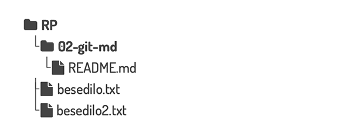
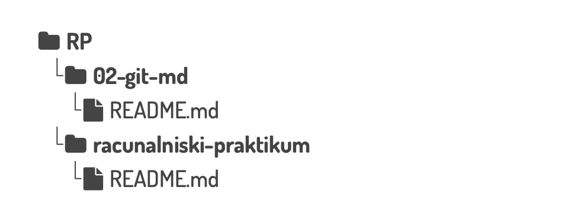
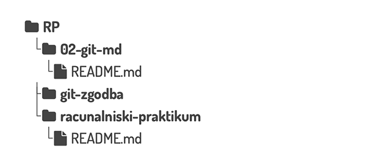

# Git in Markdown

`````{admonition} Programska oprema
:class: important
- [ukazna vrstica](namestitev:ukazna) in 
- [Visual Studio Code](namestitev:vscode).
`````

`````{admonition} Branje navodil
:class: tip
Priporočamo, da si vsako navodilo najprej natančno preberete do konca.
`````

## Označevalni jeziki

Preden se posvetimo označevalnim jezikom, moramo vedeti, kaj je navadno besedilo (angl. _plain text_). 
To je besedilo, ki vsebuje samo znake (črke, številke, ločila), brez dodatnih informacij o izgledu.
V navadnem besedilu urejamo samo znake, ne pa tudi vrste pisave, barve ali velikosti in
ne moremo uporabljati krepkega ali poševnega tiska, tabel in slik. 

`````{admonition} Primer oblikovanega besedila
:class: tip
Besedilo lahko poudarimo **krepko**, _ležeče_, <span style="color: magenta">z barvo</span>, ter z <span style="font-size: 0.7em">različnimi</span> <span style="font-size: 1.5em">velikostmi</span>.
`````

`````{admonition} Primer navadnega besedila
:class: tip
    Navadno besedilo je samo po sebi videti precej dolgočasno.
`````

Pri tem predmetu bomo navadno besedilo uporabljali predvsem v kombinaciji z označevalnimi jeziki.
V besedilu bomo uporabljali vnaprej določena zaporedja znakov, ki bodo imela poseben pomen.
Že takoj v prvi nalogi boste spoznali Markdown, preprost, a zelo razširjen označevalni jezik.

## 1. naloga: pripravite README datoteko za svoj repozitorij

`````{admonition} Del domače naloge
:class: attention
Datoteko, ki jo boste pripravili, boste potrebovali za domačo nalogo.
`````

### 1. 1. Pripravite se za delo

`````{admonition} Pozor, uporabljamo standardni zapis
:class: important
V navodilih bo spet pisalo `⟨uporabnisko-ime⟩`. Če je vaše uporabniško ime `Gandalf`, potem bo pot v vašem primeru `C:\Users\Gandalf\RP\02-git-md` (**in ne** `C:\Users\⟨Gandalf⟩\RP\02-git-md`).
`````

:::{figure-md} markdown-fig


&nbsp; Če besedilnih datotek s prejšnjih vaj še niste pobrisali, bo vsebina vašega imenika za Računalniški praktikum po koncu te vaje kot na sliki.
:::

1. V VSCode ustvarite in odprite nov imenik (npr. `C:\Users\⟨uporabnisko-ime⟩\RP\02-git-md` oz. 🍎 `/Users/⟨uporabnisko-ime⟩/RP/02-git-md`). 
   V njem naredite novo datoteko z bližnjico <kbd>Ctrl</kbd>+<kbd>N</kbd> (🍎 <kbd>Cmd</kbd>+<kbd>N</kbd>).
2. Datoteko shranite z bližnjico <kbd>Ctrl</kbd>+<kbd>S</kbd> (🍎 <kbd>Cmd</kbd>+<kbd>S</kbd>). 
   Odprlo se bo pogovorno okno z aktivnim vnosnim poljem, v katerega že takoj lahko začnete pisati ime datoteke; poimenujte jo `README.md`.
   S pritiskom na vnašalko <kbd>↵</kbd> potrdite ime.
3. Poiščite, kje v statusni vrstici piše, kakšne vrste datoteko urejate.
4. Odprite [predogled](bliznjice:vscode-splosne). Zavihek s predogledom z miško povlecite proti desnemu zgornjemu kotu okna urejevalnika,
   da preklopite v pogled, v katerem boste videli datoteko in predogled hkrati (če vam ni všeč, zavihek prestavite nazaj).
5. Kopirajte in prilepite spodnje besedilo v datoteko `README.md`.
    - **Kopiranje:** z miško se zapeljite zgoraj desno v okvirček in kliknite na ikono, ali <kbd>Ctrl</kbd>+<kbd>C</kbd> oz. 🍎 <kbd>Cmd</kbd>+<kbd>C</kbd>.
    - **Prilepite:** <kbd>Ctrl</kbd>+<kbd>V</kbd> oz. 🍎 <kbd>Cmd</kbd>+<kbd>V</kbd>. 

   Oglejte si predogled.

```markdown
<!-- glavni naslov -->
Računalniški praktikum
<!-- To je komentar, ki bo na prikazanem Markdown-u skrit. 
     V tem besedilu so v komentarjih napisana navodila za reševanje. -->

<!-- 2. nivojski razdelek -->
Bližnjice na tipkovnici

Kopiraj označeno v odložišče: Ctrl+C (**C**opy)
Izreži označeno v odložišče: Ctrl+X
Prilepi vsebino odložišča: Ctrl+V

<!-- 2. nivojski razdelek -->
Izvorna koda

Včasih pride prav značka kbd za tipke. Značko uporabimo takole:

<!-- začetek bloka z izvorno kodo -->
<kbd>Ctrl</kbd>
<!-- konec bloka z izvorno kodo -->

<!-- 2. nivojski razdelek -->
Domača naloga

<!-- Spodnji seznam bo pripravil seznam nalog. Na GitHubu bodo lepo vidna potrditvena polja, 
     VSCode pa bo prikazal samo oglate oklepaje. Ko nalogo opravite, si to lahko zabeležite tako,
     da spremenite [ ] v [x]. -->
- [ ] Izberite si še tri bližnjice, ki jih še ne uporabljate redno, in se jih naučite. 
      Dodajte jih v prvi razdelek tega dokumenta.
- [ ] Sinhronizirajte spremembe z repozitorijem na GitHubu: najprej naredite `commit` (smiselno sporočilo bi bilo npr. "dopolni README z vajami za Markdown"), nato pa še `push`.

<!-- 2. nivojski razdelek -->
Uporabne povezave

FMF učilnica <!-- https://ucilnica.fmf.uni-lj.si/ -->
Računalniški sistemi, storitve in oprema za študente <!-- https://ucilnica.fmf.uni-lj.si/mod/page/view.php?id=51619 -->
Zapiski in vaje za Računalniški praktikum <!-- https://racunalniski-praktikum.github.io/ -->
Dokumentacija za Markdown na GitHubu <!-- https://docs.github.com/en/get-started/writing-on-github/getting-started-with-writing-and-formatting-on-github/basic-writing-and-formatting-syntax -->

```

### 1. 2. Uredite dokument

Pomagajte si z [dokumentacijo za Markdown na GitHubu](https://docs.github.com/en/get-started/writing-on-github/getting-started-with-writing-and-formatting-on-github/basic-writing-and-formatting-syntax)
in sledite spodnjim navodilom.

1. Označite glavni naslov in razdelke. V navadnem besedilu jih lahko prepoznate po tem, da je v vrstici nad njimi _komentar_ 
   (besedilo med znaki `<!--` in `-->`, ki se ne izpiše).
2. V razdelku "Bližnjice na tipkovnici" uredite vrstice tako, da se bodo izpisale kot neoštevilčen seznam.
   Vključite še bližnjice, ki ste jih zabeležili v domači nalogi.
   Pomagajte si z [večimi kurzorji](bliznjice:kurzorji).
3. V seznamu oblikujte besede "Kopiraj", "Izreži" in "Prilepi" ležeče.
   Tudi tu si lahko pomagate z večimi kurzorji: s <kbd>Ctrl</kbd>+<kbd>←→</kbd> (🍎 <kbd>Cmd</kbd>+<kbd>←→</kbd>) se lahko premikate med besedami.
4. V prvi vrstici v razdelku "Izvorna koda" oblikujte `kbd` kot izvorno kodo.
5. Oblikujte blok z izvorno kodo (v datoteki sta komentarja za začetek in konec bloka).
6. V razdelku "Uporabne povezave" oblikujte oštevilčen seznam.
7. V seznamu oblikujte povezave. V vsaki vrstici je po ena povezava: besedilo naj bo besedilo povezave (tisto, kar kliknemo), 
   naslov v komentarju pa naj bo tarča povezave (tja, kamor nas povezava pelje).
8. Če vaje rešujete na šolskem računalniku, poskrbite, da boste do datoteke lahko dostopali tudi doma, saj jo boste potrebovali pri domači nalogi. Lahko uporabite na primer Dropbox, Google Drive, OneDrive (uporabljate lahko vmesnik v brskalniku) in podobno, ter pošiljanje datotek po elektronski pošti. Shranjevanje na USB ključek odsvetujemo. Za malo naprednejše uporabnike seveda priporočamo Git.

## Git, orodje za nadzor različic

Zelo poenostavljeno povedano sistemi za nadzor različic zapisujejo spremembe v datoteke na tak način, da lahko kadarkoli prikličemo poljubno različico. 
V resnici nam ponujajo še mnogo več, saj med drugim omogočajo:

- povrniti datoteke ali kar celoten projekt v prejšnje stanje, 
- primerjati, kako so se s časom zgodile spremembe, 
- pogledati, kdo je nazadnje kaj spremenil,
- sodelovanje na projektu, kjer lahko več ljudi hkrati ureja iste datoteke.

Taki sistemi so najbolj razširjeni pri programiranju, vendar so koristni tudi drugje.
Na primer, ob zaključevanju diplomskih del brez ustrezne podpore hitro nastanejo datoteke kot `diploma-koncna.tex`, `diploma-koncna2.tex`, `diploma (zadnja).tex`, `diploma (oddana).tex`, itd.

Tekom študija boste pri nekaterih predmetih (upamo pa, da tudi za lastne potrebe) uporabljali orodje [Git](https://git-scm.com), ki je najbolj razširjeno sodobno orodje. 
Urejevalnik [Visual Studio Code](https://code.visualstudio.com/) ima dobro razvito [podporo za Git](https://code.visualstudio.com/docs/editor/versioncontrol#_git-support).

Za začetek si poglejmo nekaj osnovnih izrazov, ki jih bomo uporabljali:

- _delovno drevo_ (angl. _working tree_) je imenik z vsemi datotekami projekta, na katerem smo vklopili nadzor različic.
- _sprememba_ (angl. _commit_) je osnovna enota nadzora različic, ki vsebuje zabeleženo stanje datotek skupaj s časom, avtorjem, opisom, podatkih o predhodnih spremembah in podobno. Vsaka sprememba tvori neko smiselno celoto, na primer popravek enega hrošča, dodatek nove funkcionalnosti, ...
- _repozitorij_ (angl. _repository_ ali _repo_) je zbirka vseh zabeleženih sprememb.
- _klon_ (angl. _clone_) je ena izmed kopij repozitorija. Ena se običajno nahaja na javnem strežniku (za primer lahko pogledate gradiva za Uvod v programiranje na [GitHubu](https://github.com/matijapretnar/uvod-v-programiranje)), vsak, ki dela na projektu pa ima eno kopijo še v delovnem drevesu (skrito v imeniku `.git`).

## 2. naloga: prvi koraki z Git-om

Pri tej vaji boste ponovno uporabili ukazno vrstico - vsi ukazi so pospremljeni z razlagami, da ne boste imeli občutka, da samo ponavljate magične uroke za učiteljem.

### Pripravite svoj računalnik za delo

`````{admonition} Nasvet za operacijski sistem Windows
:class: tip
Preverite, ali za kopiranje in lepljenje v programu Git Bash delujeta običajni bližnjici.
Če ne, bosta morda delovali <kbd>Ctrl</kbd>+<kbd>Ins</kbd> in <kbd>Shift</kbd>+<kbd>Ins</kbd>.
`````

`````{admonition} Nasvet za pomikanje po ukazni vrstici
:class: tip
Po ukazni vrstici se lahko premikate s puščicami na tipkovnici.
Za pomikanje po trenutni vrstici lahko uporabite puščici <kbd>←</kbd> in <kbd>→</kbd>.
Za pomikanje po zgodovini ukazov lahko uporabite puščici <kbd>↑</kbd> in <kbd>↓</kbd>.
`````

Sledite navodilom za [nastavitve `git`-a](git:nastavitve), da si nastavite uporabniške nastavitve ter SSH ključ.

### Klonirajte svoj prvi repozitorij na računalnik

1. Izberite imenik na disku, kjer boste imeli spravljene repozitorije, s katerimi boste delali pri tem predmetu; predlagamo vam, da kar v imenik `RP` (to bodo predpostavila tudi navodila v nadaljevanju).
2. V ukazni vrstici se premaknite v ta imenik.
3. Kopirajte naslov vašega repozitorija (ki ste ga ustvarili in oddali v 1. domači nalogi) z GitHub-a: 
    - Odprite stran z vašim repozitorijem v brskalniku in kliknite na zeleni gumb _Code_.
    - Izberite zavihek _Local_, pod njim pa zavihek _SSH_.
    - Kopirajte naslov, ki izgleda takole nekako:
      `git@github.com:⟨moje-uporabnisko-ime⟩/⟨moj-repozitorij⟩.git`
4. V ukazni vrstici napišite ukaz:
   ```shell
   git clone ⟨naslov-iz-zgornje-tocke⟩
   ```
   Pri prvem kloniranju vas `git` morda vpraša, če zaupate GitHubu (_The authenticity of host can't be established._).
   V tem primeru je treba napisati _yes_, preden se kloniranje izvede.
5. Preverite, da vam je uspelo: podobno kot na vajah prejšnji teden poženite ukaz `ls`, da izpišete vsebino trenutnega imenika. Videti bi morali tudi ime vašega repozitorija.
6. Če datotek `besedilo.txt` in `besedilo2.txt` še niste pobrisali, to lahko naredite zdaj v ukazni vrstici. Ukaz je `rm *.txt`, ampak preden ga poženete, razmislite, kaj naredi.
7. Oglejte si še vsebino svojega imenika `RP` in jo primerjajte s spodnjo.

:::{figure-md} markdown-fig


&nbsp; Važno je, kam ste klonirali repozitorij `racunalniski-praktikum`.
:::


## 3. naloga: Git zgodba

`````{admonition} Nastavitve uporabnika
:class: attention
Če še niste [uredili nastavitev uporabnika za Git](git:nastavitve-uporabnika), to naredite zdaj.
Če pridete do prvega _commita_ preden uredite nastavitve, vam bo Git prijazno povedal, da morate to narediti. 
V tem primeru sledite navodilom, ki se izpišejo, na koncu pa morate še enkrat pognati `git commit -m "⟨sporočilo⟩"`
`````

Pojdite na repozitorij [git-zgodba](https://github.com/racunalniski-praktikum/git-zgodba) in sledite navodilom.
Bodite pozorni na to, kam boste klonirali repozitorij.
Priporočamo, da v isti imenik, v katerega ste že klonirali svoj prvi repozitorij.

:::{figure-md} markdown-fig


&nbsp; Važno je, kam ste klonirali repozitorij `git-zgodba`.
:::

### Urejanje datotek iz ukazne vrstice

1. Poženete program `nano`, ki mu podate ime datoteke, ki jo želite urediti.
   ```shell
   nano ⟨ime-datoteke⟩
   ```
   Spomnite se, da vam imen datotek ni vedno treba pisati. Ponavadi je dovolj prvih nekaj črk, nakar 
   stisnete tipko <kbd>Tab</kbd>, da dopolnite ime.
2. S puščicami <kbd>↑↓←→</kbd> se lahko premikate po besedilu, lahko tudi pišete ali brišete znake, kot običajno.
3. Spremembe shranite z bližnjico <kbd>Ctrl</kbd>+<kbd>O</kbd> (stisnite vnašalko, da potrdite ime datoteke, v katero želite pisati).
4. Program zaprete z bližnjico <kbd>Ctrl</kbd>+<kbd>X</kbd>.

Če želite samo ustvariti novo datoteko, uporabite program `touch`:
```shell
touch ⟨ime-datoteke⟩
```

## Dodatni viri

* [Git Time](https://git.bradwoods.io/), spletna igrica za spoznavanje Gita, ki jo je razvil Brad Woods.
* [Learn Git Branching](https://learngitbranching.js.org), nekoliko naprednejša spletna igra za spoznavanje Gita s poudarkom na delu z vejami.
* [Oh My Git!](https://ohmygit.org), igra za spoznavanje gita, ki kmalu predstavi, kako lahko na datotekah sodeluje več avtorjev.
