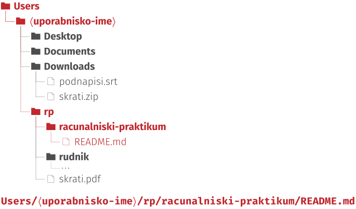
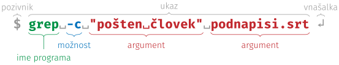

# Ukazna vrstica

`````{admonition} Programska oprema
:class: important
- [ukazna vrstica](namestitev:ukazna),
- [Visual Studio Code](namestitev:vscode).
`````

## Datoteke in imeniki

Vsi podatki na računalniku so shranjeni v datotekah (angl. _files_),
poimenovanih kosih podatkov, kot so slike, besedila, zvočni posnetki ali programi.
Organiziramo jih tako kot liste papirja v kartonskih mapah:
razporedimo jih po imenikih (angl. _directories_ ali _folders_),
ki lahko poleg datotek vsebujejo tudi druge imenike.

Ime datoteke ima dva dela: pred zadnjo piko je ime, za njo pa končnica, na primer `.jpg` v `pocitnice.jpg` ali `.docx` v `esej-na-maturi.docx`.
Po končnici operacijski sistem ve, s katerim programom naj datoteko odpre;
če jo spremenite, se datoteka pogosto ne odpre več.
Današnji operacijski sistemi končnic ponavadi ne prikazujejo, zato [vklopite prikazovanje končnic in skritih datotek](faq:koncnice-skrite).

Isto vrsto podatkov lahko shranimo na več načinov in vsak ima ponavadi svojo končnico. Nekaj pogostih:

| Slike   | Dokumenti | Zvok   | Video  | Ostalo |
| ------- | --------- | -------| -------| ------ |
| `.jpg`  | `.docx`   | `.mp3` | `.mp4` | `.zip` |
| `.jpeg` | `.pptx`   | `.wav` | `.mov` | `.rar` |
| `.gif`  | `.xlsx`   | `.ogg` | `.avi` | `.dmg` |
| `.bmp`  | `.pdf`    |        | `.mpg` | `.exe` |
| `.psd`  | `.txt`    |        | `.mkv` | `.py`  |
| `.svg`  | `.csv`    |        | `.wmv` |        |

<!-- 
Computer Skills Course: File Management, Part 2
https://www.youtube.com/watch?v=DGd48PGbnBs
 -->
Datoteke in imenike na svojem računalniku pregledujete v upravitelju datotek:
v sistemu Windows je to Raziskovalec (angl. _File Explorer_), na macOS pa Finder.
Vse, kar je vaše, je v vašem domačem imeniku (angl. _home directory_),
skupaj z imeniki, kot so Desktop, Documents in Downloads, ki jih je ustvaril operacijski sistem.
V učbeniku predpostavljamo angleška privzeta imena, kakršna so na računalnikih v učilnici; če so na vašem računalniku drugačna, uporabite svoja.
Pozor: v sistemu Windows v slovenščini jih Raziskovalec le prikazuje kot Namizje, Dokumenti in Prenosi, v ukazni vrstici pa so še vedno angleška.
Upravitelj datotek lahko vsebino imenika pokaže kot mrežo ikon ali kot seznam.
Seznam je uporabnejši: pri vsaki datoteki vidite tudi vrsto, velikost in datum zadnje spremembe, s klikom na naslov stolpca pa seznam po tem stolpcu uredite.
Na macOS se ta pogled imenuje _List_, v sistemu Windows _Details_.
Kadar datoteko preimenujete, upravitelj izbere samo ime brez končnice, da je po nesreči ne spremenite.

Umetna inteligenca, ki dela z vašimi datotekami, se po njih znajde enako kot vi: po imenih datotek in imenikov.
Pospravljene datoteke s smiselnimi imeni ji torej pomagajo prav toliko kot vam.
Datoteke pospravljate tako, da ustvarite imenike (<kbd>Ctrl</kbd>+<kbd>Shift</kbd>+<kbd>N</kbd>, 🍎 <kbd>Cmd</kbd>+<kbd>Shift</kbd>+<kbd>N</kbd>) in datoteke vanje premaknete.
Lažje gre z dvema oknoma: imenik odprite v novem zavihku in zavihek odvlecite v svoje okno.
Več datotek izberete hkrati: s pritisnjeno tipko <kbd>Ctrl</kbd> (🍎 <kbd>Cmd</kbd>) dodajate posamezne datoteke, s <kbd>Shift</kbd> pa izberete vse med dvema.
Isti tipki delujeta tudi pri izbiranju besed v urejevalniku ali celic v preglednici.
Datoteko lahko namesto premika tudi kopirate.
Kopiranje velikih datotek lahko traja dlje, premik znotraj istega diska pa se zgodi v trenutku:
datoteka se v resnici ne premakne, spremeni se le zapis o tem, v katerem imeniku je.

Imenik lahko vsebuje druge imenike, ti spet svoje, in tako naprej.
To strukturo si lahko predstavljamo kot podrto drevo, kot na {numref}`slika:drevo-domaci`:
korenski imenik, ki vsebuje vse druge, je skrajno levo, vsak imenik je zamaknjen pod tistega, v katerem je, datoteke pa so listi na koncih vej.
Pot (angl. _path_) do datoteke našteje imenike od korena do nje.

`````{admonition} Opomba
:class: note
Imena imenikov in datotek v poti ločujejo poševnice: v ukazni vrstici poševnica `/`, tudi v Git Bash v sistemu Windows, v Raziskovalcu pa leva poševnica `\`.
`````

:::{figure-md} slika:drevo-domaci
:width: 80%
:align: center


&nbsp; Domači imenik z imeniki iz 1. poglavja in pot do datoteke `README.md`
:::

Več datotek lahko stisnemo v eno samo, arhiv (angl. _archive_),
ki ga prepoznamo po končnicah `.zip`, `.rar`, `.7z`, `.tar` ali `.gz` in po ikoni z zadrgo.
Windows vsebino arhiva pokaže, kot da bi bil navaden imenik, a to je le videz:
za (skoraj) vsa opravila pri tem predmetu je treba arhiv najprej [odpakirati](faq:zip).

## Ukazi

Ukazna vrstica je uporabniški vmesnik, ki so ga največ uporabljali v bakreni dobi računalništva,
naprednejšim uporabnikom računalnika pa še vedno pride prav.
Če še niste med njimi, boste do konca študija prav gotovo tudi vi.

Ukazi v ukazni vrstici so programi.
Besede za imenom programa so njegovi _argumenti_: podatki, ki jih program potrebuje za izvedbo svoje naloge.
Argument, ki se začne z `-`, je _možnost_: ne pove, s čim naj program dela, ampak kako.
Program `cd` (kratko za angl. _change directory_) uporabimo z enim argumentom, potjo do imenika, v katerega se hočemo prestaviti,
program `pwd` (kratko za angl. _print working directory_) pa argumentov ne potrebuje.

:::{figure-md} slika:anatomija-ukaza
:width: 80%
:align: center


&nbsp; Sestavni deli ukaza v ukazni vrstici
:::

Dele ukaza ločijo presledki, zato ime s presledki postavimo med narekovaje:
brez njih bi `cd Vhodna dvorana` pomenilo premik v imenik `Vhodna` z odvečnim argumentom `dvorana`.
Ukazi imajo lahko še druge dele, a te bomo spoznavali sproti, ko jih bomo potrebovali.

Ukazno vrstico boste uporabljali kar v urejevalniku VSCode: odprete jo z ukazom _Terminal_ > _New Terminal_, pokaže pa se v podoknu (angl. _Panel_) na dnu okna.
Začne v imeniku, ki ga imate odprtega v urejevalniku, zato imenik, v katerem želite delati, najprej odprite v VSCode (_File_ > _Open Folder_).
V sistemu Windows preverite, da v podoknu desno zgoraj piše `bash` in ne `powershell`; če ne, kliknite puščico ob gumbu `+` in izberite _Git Bash_.
Da vam tega ne bo treba ponavljati, [nastavite Git Bash za privzeto ukazno vrstico](faq:vscode-bash).
Ukazno vrstico lahko odprete tudi brez urejevalnika, [naravnost iz upravitelja datotek](faq:ukazna-imenik).

Najpogostejše ukaze smo zbrali v [plonkcu za ukazno vrstico](plonkec:ukazna-vrstica).
Nekaj primerov:

```bash
pwd                          # izpiše pot do trenutnega delovnega imenika
ls                           # izpiše vsebino trenutnega delovnega imenika
cd rp                        # premakne nas v podimenik rp
cd racunalniski-praktikum    # in še en imenik globlje
cat README.md                # izpiše vsebino datoteke README.md
cd ..                        # premakne nas en imenik višje, nazaj v rp
cd ~                         # premakne nas v domači imenik, od koderkoli
cd rp/racunalniski-praktikum # po poti se premaknemo za več imenikov naenkrat
```

## Regularni izrazi

[Regularni izrazi](https://en.wikipedia.org/wiki/Regular_expression) (angl. _regular expressions_ ali kratko _regex_) so zaporedja znakov, s katerimi opišemo vzorce v navadnem besedilu.
Najpreprostejši regularni izraz je natančno ujemanje, ki ste ga gotovo že kdaj uporabili: vse pojavitve besede `kuža` poiščemo z regularnim izrazom `kuža`.
Kaj pa če želite poiskati vse številke v besedilu?
To naredimo z regularnim izrazom `\d+`: `\d` je vzorec, ki predstavlja eno (katerokoli) števko, `+` pa pomeni eno ali več ponovitev tistega, kar piše pred njim.

Z nekaj dodatnimi znaki opišemo bolj zapletene vzorce: en znak iz nabora, ponovitve, izbiro med možnostmi in skupine.

| Vzorec | Pomen                                  | Primer                                                        |
| ------ | -------------------------------------- | ------------------------------------------------------------- |
| `.`    | en poljuben znak                       | `k.ža` se ujema s `kuža` in `koža`                            |
| `[…]`  | en znak izmed naštetih                 | `[0-9]` je števka, `[čšž]` šumnik, `[a-z]` mala črka          |
| `+`    | ena ali več ponovitev                  | `[0-9]+` se ujema s `7` in `21`                               |
| `*`    | nič ali več ponovitev                  | `[0-9]+,[0-9]*` se ujema s `3,` in `3,14`                     |
| `?`    | nič ali ena ponovitev (neobvezen del)  | `kuž[ae]k?` se ujema s `kuža`, `kuže`, `kužak` in `kužek`     |
| `\|`   | izbira                                 | `pes\|kuža\|maček` se ujema s katerokoli od treh besed        |
| `(…)`  | skupina                                | `(ha)+` se ujema s `ha`, `haha`, `hahaha` …                   |

Ponovitev in izbira veljata za en znak ali za skupino v okroglih oklepajih.
Oklepaji hkrati označijo skupino (angl. _capture group_): del besedila, ki se ujema z vsebino oklepajev, si iskalnik zapomni, zato se nanj lahko sklicujemo.

Regularne izraze boste uporabljali na dveh mestih.
V urejevalniku VSCode jih vklopite z ikono `.*` v iskalnem polju (<kbd>Ctrl</kbd>+<kbd>F</kbd>, 🍎 <kbd>Cmd</kbd>+<kbd>F</kbd>) ali v polju za zamenjavo (<kbd>Ctrl</kbd>+<kbd>H</kbd>, 🍎 <kbd>Cmd</kbd>+<kbd>Option</kbd>+<kbd>F</kbd>).
Pri zamenjavi `$1` pomeni prvo skupino, `$2` drugo in tako naprej:
z iskanjem `(\d+),(\d+)` in zamenjavo `$1.$2` bi v vseh časih v podnapisih decimalno vejico zamenjali s piko.
V ukazni vrstici z regularnimi izrazi iščemo z ukazom `grep`, ki izpiše vrstice, v katerih se vzorec ujema — na primer v podnapisih iz 3. naloge, ko jih shranite v UTF-8:

```bash
grep -E "Grozd|Gornik" podnapisi.srt     # vrstice, v katerih nastopa Grozd ali Gornik
grep -c -E "Grozd|Gornik" podnapisi.srt  # samo število takih vrstic
```

Regularni izrazi obstajajo v več različicah, ki se razlikujejo v podrobnostih.
Nekatere na primer nimajo posebnega vzorca za števke, zato jih je treba opisati z `[0-9]`; `grep` pozna izbiro `|` in skupine šele z možnostjo `-E` (angl. _extended_).
Tu smo opisali le majhen del; kar boste še potrebovali, boste našli sami.

## 1. naloga: škrati

Glavni namen te naloge je, da začnete razvijati boljši občutek za to, kako računalnik deluje v ozadju.

Za hitrejše preklapljanje med oknom z navodili in oknom z ukazno vrstico priporočamo
bližnjico <kbd>Alt</kbd>+<kbd>Tab</kbd> (🍎 <kbd>Cmd</kbd>+<kbd>Tab</kbd>).
Tudi sicer bo tipka <kbd>Tab</kbd> pri tej nalogi hudo uporabna:
dopolni vam ukaz, kar še posebej pride prav pri dolgih imenih s presledki.
Ne pozabite, da taka imena postavimo med narekovaje: `"To je dolgo ime z veliko presledki"`.

1. Prenesite arhiv [`skrati.zip`](02-ukazna-vrstica/skrati.zip) in ga [odpakirajte](faq:zip).
   Do konca naloge si zapomnite, kam ste ga shranili.
2. V VSCode odprite imenik `rudnik` (_File_ > _Open Folder_) in nato ukazno vrstico (_Terminal_ > _New Terminal_).
   Če vas VSCode vpraša, ali avtorjem imenika zaupate (_Do you trust the authors?_), potrdite, sicer ukazna vrstica ne deluje.
3. Odprite še datoteko `skrati.pdf`.
4. Preverite, da ste v pravem imeniku: v ukazno vrstico napišite `pwd` in pritisnite vnašalko <kbd>↵</kbd> (angl. _enter_ ali _return_).
   Izpisala se bo nova vrstica. Če na koncu piše `rudnik`, je vse ok, sicer pa poiščite pomoč.
5. V ukazno vrstico prilepite spodnji ukaz in pritisnite vnašalko <kbd>↵</kbd>.
   ```bash
   cd "Vhodna dvorana/Dolgočasna pravokotna dvorana/Radegastov kot/Zahodno križišče"
   ```

<!-- Nasvet za samostojni Git Bash (zunaj VSCode) na Windows:
Preverite, ali za kopiranje in lepljenje v programu Git Bash delujeta običajni bližnjici.
Če ne, bosta morda delovali Ctrl+Ins in Shift+Ins.
-->

<!-- Dodatno za Windows Powershell (staro)
$OutputEncoding = [System.Console]::OutputEncoding =[System.Console]::InputEncoding = [System.Text.Encoding]::UTF8 
$PSDefaultParameterValues['*:Encoding'] = 'utf8'
? https://stackoverflow.com/questions/10651975/unicode-utf-8-with-git-bash
-->

Naloga je interaktivna zgodba, v kateri boste uporabljali uroke, ki pa so v resnici programi.
V zgodbi so navodila in namigi za posamezni odsek podani ležeče.
Z branjem nadaljujte šele, ko opravite vse, kar piše.
Sedaj lahko sledite navodilom v PDF datoteki.
Veliko zabave in pazite na glavo, stropi so nizki!

## 2. naloga: opisovanje vzorcev z regularnimi izrazi

Kakih 20 minut rešujte lekcije na spletni strani [RegexOne](https://regexone.com) ali [RegexLearn](https://regexlearn.com/learn/regex101), ali pa na obeh.
Na gumb _Continue_ vam ni treba klikniti, dovolj je, da pritisnete vnašalko <kbd>↵</kbd>.
Če ste regularne izraze že kdaj uporabljali, se lahko preizkusite v [regex križanki](https://regexcrossword.com).

## 3. naloga: podnapisi

S spleta ste prenesli podnapise za film, a so nekatere črke napačne.

1. Prenesite datoteko [`podnapisi.srt`](02-ukazna-vrstica/podnapisi.srt) in jo odprite v urejevalniku VSCode.
   Datoteke ne urejajte in je še ne shranjujte, sicer se napačne črke shranijo in jih ne boste mogli več popraviti.
2. Poiščite podnapis številka 76. Katere črke so napačne?
   Če je podnapis videti pravilen, prosite za pomoč.
3. V statusni vrstici kliknite na kodiranje (tam piše `UTF-8`) in izberite _Reopen with Encoding_.
   Poiščite kodiranje, pri katerem je podnapis 76 videti takole:
   ```
   Če ste nedolžni nad njim, zakaj se bojite
   njegovih pisem? — On je bil pošten človek.
   ```
   Besedilo je slovensko, zato poskusite s srednjeevropskimi kodiranji (angl. _Central European_).
   Preverite vse tri šumnike: pri napačnem kodiranju so lahko nekateri pravilni, drugi pa ne.
4. V statusni vrstici še enkrat kliknite na kodiranje, izberite _Save with Encoding_ in nato `UTF-8`.
5. Odprite iskanje (<kbd>Ctrl</kbd>+<kbd>F</kbd> oz. 🍎 <kbd>Cmd</kbd>+<kbd>F</kbd>) in vklopite regularne izraze:
   kliknite na ikono `.*` v iskalnem polju ali pritisnite <kbd>Alt</kbd>+<kbd>R</kbd> (🍎 <kbd>Cmd</kbd>+<kbd>Option</kbd>+<kbd>R</kbd>).
   Napišite regularni izraz, ki se ujema s časom v podnapisih, na primer z `00:00:21,480`.
   Preverite: vsak podnapis ima dva časa, zato mora biti zadetkov dvakrat toliko, kot je podnapisov.
6. Odprite ukazno vrstico (_Terminal_ > _New Terminal_), se s `cd` premaknite v imenik, kamor ste shranili datoteko, in čase preštejte še z ukazom
   ```bash
   grep -cE "⟨vzorec⟩" podnapisi.srt
   ```
   Z možnostjo `-c` (angl. _count_) ukazu povemo, naj izpiše samo število zadetkov,
   z možnostjo `-E` (angl. _extended_) pa, naj vzorec bere v razširjeni sintaksi, isti, kot jo pozna VSCode.
   Vzorca `\d` `grep` ne pozna, zato števke opišite z `[0-9]` (na macOS `\d` sicer deluje).
   Zakaj je število pol manjše kot v urejevalniku?
