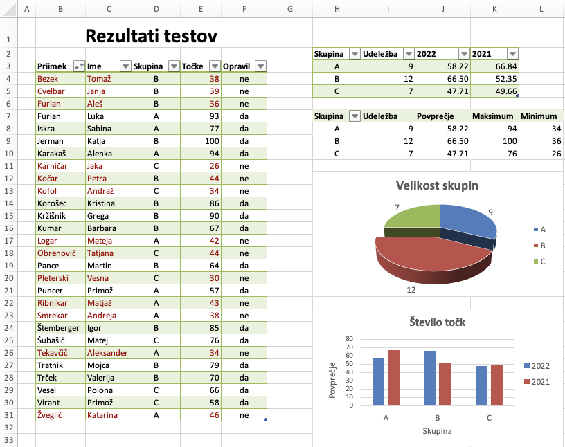
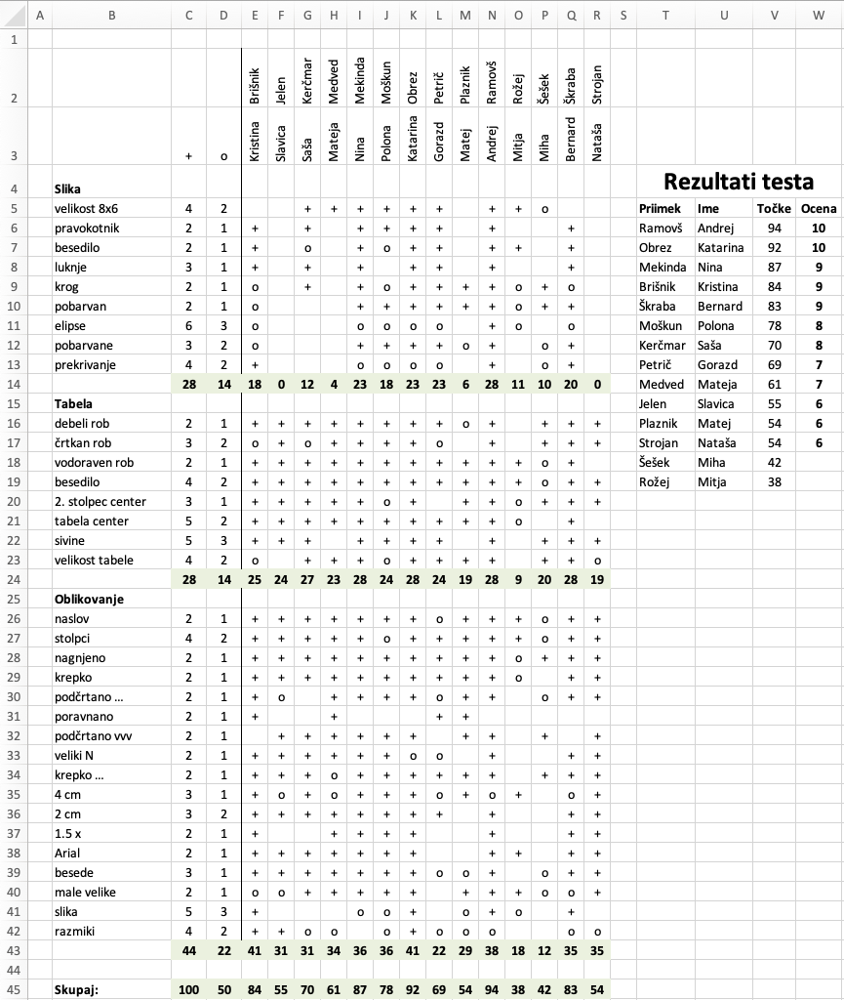

# Razpredelnice

`````{admonition} Programska oprema
:class: important
- [Excel](namestitev:microsoft)
`````

## Pripravljalne naloge

## Rezultati

V zvezku `rezultati.xlsx` so zbrani rezultati testa, ki so ga študenti
pisali v treh skupinah.



1.  Odstranite stolpec `H` in študente uredite naraščajoče po
    priimkih.

2.  V stolpcu `F` s funkcijo `IF` sestavite formulo, ki pove, ali
    ima študent vsaj $50$ točk. V stolpcu `I` sestavite formulo, ki
    prešteje, koliko študentov je pisalo test v vsaki skupini (uporabite
    `COUNTIF`). V stolpcu `J` s funkcijo `AVERAGEIF` izračunajte
    povprečno število točk za vsako skupino. Rezultat naj bo izpisan na
    dve decimalki (ne zaokrožen).

3.  Tabelo podobno zgornji sestavite še z vrtilno tabelo. Prikažite
    udeležbo, povprečje, minimalno ter maksimalno število točk. *Namig:*
    polje Točke lahko v vrednostih vrtilne tabele uporabite več kot
    enkrat, z različnimi funkcijami združevanja.

4.  Sestavite 3D tortni diagram z udeležbo po skupinah. Odmaknite
    največji kos in dodajte oznake z udeležbo. Sestavite stolpični
    diagram s povprečji točk po skupinah za leti 2021 in 2022. Popravite
    število decimalk na navpični osi, dodajte oznake osi in legendo.

5.  Točke manjše od $50$ s pogojnim oblikovanjem pobarvajte rdeče, prav
    tako pa tudi priimki in imena študentov, ki niso opravili testa.
    *Namig:* v meniju za pogojno oblikovanje poiščite in izberite slog
    ter oblikovanje s formulo: `$E5<50`.

## Smučanje

V datoteki `smucanje.csv` so zbrani podatki o skupnih zmagah v
svetovnem pokalu v alpskem smučanju. Podatki so ločeni z vejicami,
uporabljena je kodna tabela `UTF-8`. Podatke uvozite v delovni zvezek
`smucanje.xlsx` na list `Podatki`. Uvožene podatke označite kot
tabelo: in jo poimenujte `Zmagovalci`. Naredite nov list `Zmage` na
katerem sestavite pivotni tabelo in diagram, kot je prikazano na sliki.
Pri izbiri podatkov za pivotno tabelo lahko napišete kar
`Podatki!Zmagovalci`.

Prva pivotna tabela naj vsebuje pregled zmag po državah in spolu
tekmovalcev. Pivotno tabelo poimenujte `PoDrzavah`. Tabelo uredite
padajoče po skupnem številu zmag.

Druga pivotna tabela naj prikazuje zmagovalce iz Evrope, ki so zmagali
vsaj dvakrat. Ustrezen filter najdete v meniju, ki vam ga odpre gumb za
filtriranje v glavi tabele. Izberite ustrezno polje in uredite
filtriranje po vrednost. Te razdelite na moške in ženske kot prikazuje
slika in tabelo uredite padajoče po skupnem številu zmag.


## Poraba

V delovnem zvezku `poraba.xlsx` so vpisani podatki o tem, kdaj in
koliko goriva smo dotočili v avto. Predpostavite, da gorivo vedno
dotočimo do polnega.

1.  Izračunajte prevožene kilometre (pri tem izpustite prvo vrstico).
    Gumbe v glavi tabele lahko skrijete na zavihku *Table* (možnost
    *Filter Button*).

2.  S pomočjo funkcij `MATCH` in `INDEX` izračunajte ceno natočenega
    goriva.

3.  Porabo (litre na 100 km) izračunate po formuli
    $100 \cdot \frac{\text{litri}}{\text{prevoženo}}$.

4.  V zadnjem stolpcu grafično prikaži porabo. S formulo kopirajte
    vrednost iz stolpca Poraba. Za zadnji stolpec uporabite pogojno
    oblikovanje: . Za *minimum* in *maksimum* iz menija izberite *Lowest
    Value* in *Highest Value*.

5.  Sestavite pivotno tabelo s pregledom prevoženih kilometrov in porabe
    po mesecih. Stolpec skupno lahko skrijete na zavihku *Design*.


## Točkovanje

V delovnem zvezku `tockovanje.xlsx` so zbrani podatki o točkovanju
testa, ki so ga pisali študenti. Vsaka naloga je bila točkovana s
plusom, krogcem ali minusom (minusi v tabelo niso vpisani), vrednosti
plusa in krogca pa so različne pri posameznih nalogah.



1.  Stolpce uredite tako, da bodo priimki študentov urejeni po abecednem
    vrstnem redu: , pod pa izberete . Ni nujno, da se bodo šumniki
    uredili pravilno, to je za zdaj ok.

2.  Na obarvanih poljih (vrstice 14, 24, 43 in 45), izračunajte dosežene
    točke s funkcijama `SUM` in `SUMIF`. Formule najprej sestavite
    za enega študenta in jih kopirajte k drugim.

3.  Pod \"\>Rezultati testa\"\< kopirajte imena, priimke in dosežene
    točke (vrednosti, ne formul): uporabite in .

4.  Študente uredite padajoče po doseženih točkah in izračunajte ocene.
